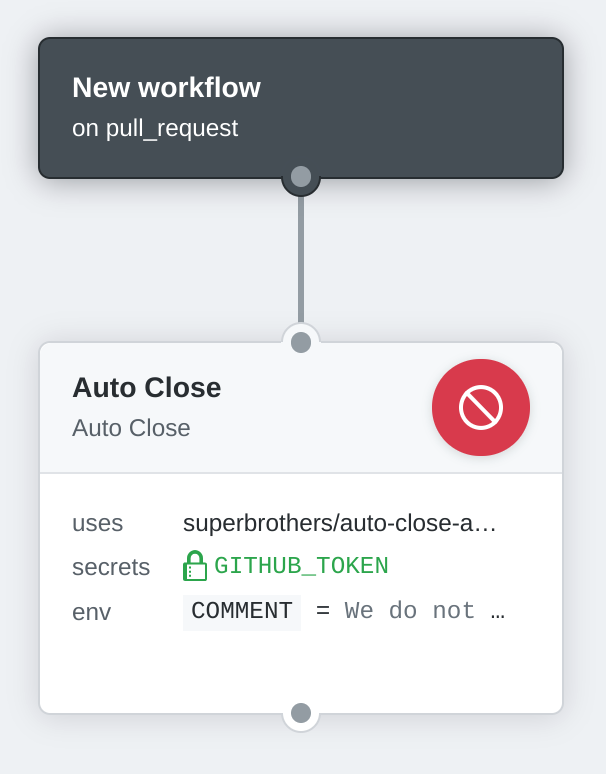

# :no_entry_sign: Auto close pull requests GitHub Action

A GitHub Action to automatically close pull requests.

## Usage

This Action subscribes to `pull_request` events. When receiving a `pull_request` event, this action close the pull request triggered by the event immediately.

```workflow
workflow "New workflow" {
  on = "pull_request"
  resolves = ["Auto Close"]
}

action "Auto Close" {
  uses = "superbrothers/auto-close-action"
  env = {
    # Optional. Post a issue comment just before closing a pull request.
    COMMENT = "We do not accept PRs. If you have any questions, please feel free to connect us."
  }
  secrets = ["GITHUB_TOKEN"]
}
```



## Environment variables

- `COMMENT` - *Optional*. Post an issue comment just before closing a pull request.

## LICENSE

This software is released under the MIT License.
